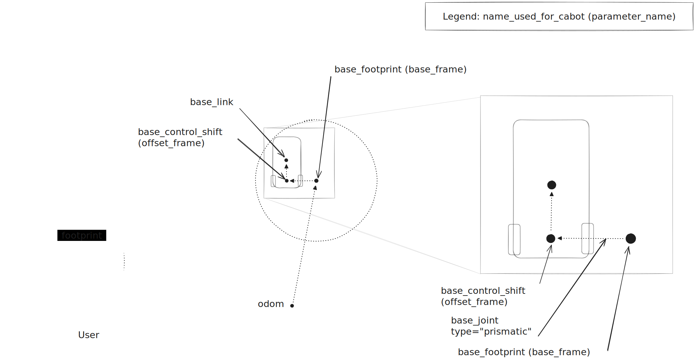

# CaBot Description

|Package|Description|
|---|---|
|[cabot_description](cabot_description)|robot URDF description|

# Requirements for CaBot

- To deal with a footprint that includes the robot and the user, CaBot has a unique TF tree
- TF Frames
    - odom
    - base_footprint (param name: base_frame)
    - base_control_shift (param name: offset_frame)
- Adjustable Joint (from base_footprint to base_control_shift) for left handed configuration
    - base_joint (param name: TBD, not configurable now)
        - type="prismatic"
	- lower="0"
	- upper="0.25"

# License

[MIT License](LICENSE)

---
The following files/folder are under Apache-2.0 License

- cabot_description/urdf/sensors/_d435.gazebo.xacro
- cabot_description/urdf/sensors/_d435.urdf.xacro
